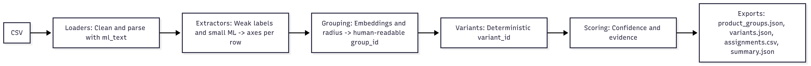

# Product Hierarchy Classifier

ML-first system that turns noisy retail feeds into readable product groups, deterministic variants, and per-assignment confidence scores—robust to missing fields, ambiguous descriptions, and vendor quirks.

---

## 🔭 Overview

**Problem.** Retail catalogs mix duplicates, bundles, inconsistent specs, and uneven text quality. Search, merchandising, and analytics need:
- **Product groups** (brand + family + optional generation)
- **Variants** (configuration/size/silicon/packaging)
- **Confidence** to prioritize actions downstream

**Approach.** Favor ML/DL-powered methods (sentence embeddings + small classifiers) with gentle normalizers for weak labels. Avoid brittle, vendor-specific rules. Always assign every product (low-confidence allowed in rare edge cases).

**Dataset.** CSV with the columns described in **Input** below.

---

## 🏗️ Architecture

**Module interaction (left → right):**
1. `loaders.py` – deep text cleaning + JSON/specs parsing → `ml_text`
2. `extractors.py` – weak labels + small ML models → per-row axes
3. `grouping.py` – SBERT/TF-IDF + radius neighbors → readable `group_id`
4. `variants.py` – deterministic serialization → readable `variant_id`
5. `scoring.py` – text cohesion + axis features → confidence & evidence
6. `pipeline.py` – orchestration & exports (JSON/CSV summaries)

**Architecture Diagram**



**Design tenets**
- **ML-first:** embeddings for similarity; TF-IDF fallback if SBERT isn’t available.
- **Readable IDs:** no hashes; stable slugs and numeric suffixes (`-2`, `-3`, …) on collisions.
- **Separation of concerns:** each file does one job; the pipeline only wires them together.
- **Determinism:** fixed seeds, stable sorting, predictable suffixing.

---

## 📦 Repository Layout

```
product-hierarchy-classifier/
├─ README.md
├─ requirements.txt
├─ src/
│  ├─ __init__.py
│  ├─ loaders.py          # ingestion + deep text cleaning + ml_text
│  ├─ normalize.py        # gentle parsers & tokens (GB/TB→GB, inches, color, cpu/gpu, 1440p, brand, slugify)
│  ├─ specs_map.py        # canonical spec keys (no value parsing)
│  ├─ extractors.py       # weak-labels + TF-IDF/LogReg → axes inference
│  ├─ grouping.py         # embedding-based grouping → readable group_id
│  ├─ variants.py         # deterministic variant_id serialization
│  ├─ scoring.py          # confidence + evidence (cohesion, axes, sizes)
│  └─ pipeline.py         # CLI orchestrator and exporters
└─ output/                # created at runtime
   ├─ product_groups.json
   ├─ variants.json
   ├─ assignments.csv
   └─ summary.json
```

---

## 📥 Input & 📤 Output

### Input: CSV (Full Schema)

The pipeline expects a single CSV containing the following columns. 

Characteristics: noisy text, Unicode artifacts, partial/malformed JSON specs, vendor idiosyncrasies (e.g., “Refurbished”, “Renewed”, “Open Box”). 

Types are **expected** types after ingestion; raw values may be strings and will be normalized in `loaders.py`. 

| Column | Type | Required | Used by | Notes |
|---|---|---:|---|---|
| `product_id` | string | ✅ | all | Unique row id; emitted in outputs. If missing, fallback to `vendor_sku_id` when configured. |
| `seller_id` | string | – | analytics (future) | Kept for quality scoring/diagnostics; not used for grouping in v1. |
| `category` | string | – | grouping / sanity | If blank, derived from `primary_category_path`. |
| `sub_category` | string | – | grouping / sanity | Used to constrain neighborhoods (e.g., laptops vs TVs). |
| `name` | string | ✅ | grouping/scoring | Primary title; contributes heavily to `ml_text`. |
| `brief_description` | string | – | grouping/scoring | Cleaned, HTML-unescaped (e.g., `&nbsp;`), merged into `ml_text`. |
| `details` | **JSON string** | – | loaders/extractors | Parsed to dict. See **details schema** below. Source of most specs. |
| `shipping_time` | string | – | – | Free text (e.g., `", Shipping, Arrives Jun 25, Free"`). Currently ignored. |
| `review_rating` | float | – | analysis (future) | 0–5 scale if present. Not used in grouping. |
| `reviews` | JSON array or string | – | – | Often `"[]"`. Count can be used for analysis; currently ignored. |
| `vendor_sku_id` | string | – | ids/joins | External id; stored for traceability. |
| `data_refreshed_at` | ISO datetime | – | logs/summary | Ingestion freshness; not used in modeling. |
| `created_at` | ISO datetime | – | analysis (future) | Product creation time. |
| `is_active` | bool/str | – | analysis (future) | `"TRUE"/"FALSE"` normalized to boolean. We still assign inactive rows. |
| `out_of_stock` | bool/str | – | analysis (future) | Stock status; not used in grouping. |
| `updated_at` | ISO datetime | – | logs/summary | Last product update time. |
| `brand` | string | – | grouping/extractors | Conservatively normalized (`normalize_brand`). If blank, fallback to `details.brand`. |
| `model` | string | – | metadata | Carried through as metadata only; not used for decisions. |
| `upc` | string | – | tie-break (future) | Optional unique code; reserved for stricter dedupe. |
| `category_paths` | JSON array of strings | – | grouping/sanity | Alternative taxonomy paths. Parsed if provided. |
| `primary_category_path` | string | – | grouping/sanity | Main taxonomy string like `electronics/computers/laptops`.|

**Important ingestion notes**

- Column names are trimmed; trailing spaces (e.g., `primary_category_path `) are normalized.
- Booleans like `"TRUE"/"FALSE"` are coerced to true booleans.
- `details` is parsed safely; failures leave `details_parsed=None` without crashing the run.
- All text contributing to `ml_text` undergoes: Unicode NFKC, control-char stripping, HTML unescape, dash/quote normalization, whitespace squeeze, acronym-preserving casing.

#### `details` JSON (observed keys and handling)

Example (truncated): 

```json
{
  "url": "https://www.walmart.com/ip/...",
  "brand": "Apple",
  "color": "Silver",
  "image": "https://...jpeg",
  "model": "MD760LL/A",
  "images": ["https://...117x117.jpeg", "..."],
  "pricing": {
    "sale": 186,
    "onSale": false,
    "regular": 186,
    "savings": {"amount": 0, "percentage": 0},
    "currency": "USD"
  },
  "shipping": {"info": ", Shipping, Arrives Jun 20, Free", "available": true, "freeShipping": false},
  "specifications": {
    "Brand": "Apple",
    "Model": "MD760LL/A",
    "Edition": "Air",
    "Features": "Backlit Keyboard",
    "Condition": "Restored: Like New",
    "RAM Memory": "4 GB",
    "Screen Size": "3 in",
    "Battery Life": "12 h",
    "Processor Type": "core_i5",
    "Processor Brand": "Intel",
    "Processor Speed": "1.3 GHz",
    "Hard Drive Capacity": "128 GB",
    "Solid State Drive Capacity": "128 TB",
    "Operating System": "Mac OS"
  },
  "sellerProductId": "984065346",
  "customerTopRated": true,
  "productVariations": [
    {"price": 186, "options": {"Hard Drive Capacity": "128 GB"}, "product_id": "3BWQGFVID9KM"},
    {"price": 265, "options": {"Hard Drive Capacity": "256 GB"}, "product_id": "5DJ7UO4ZPJO0"}
  ],
  "customerReviewCount": 682
}
```

- `specifications` is mapped to canonical keys via `specs_map.py` (e.g., `"RAM Memory"` → `ram_gb`, `"Screen Size"` → `screen_inches`).  
- Value parsers in `normalize.py` handle units and tokens: GB/TB → GB, inches, CPU/GPU tokens, 1440p, panel type, condition, color.  
- Outliers are tolerated and penalized downstream (e.g., `"Screen Size": "3 in"`, `"SSD Capacity": "128 TB"`).  
- Pricing/shipping/images are not used for grouping; they remain available for analytics/exports.

**Field priority & fallbacks**

- **Brand:** `brand` column → `details.brand` → inferred from title tokens (conservative).  
- **Model:** carried as metadata; never used to **force** a merge.  
- **Category/Sub:** `sub_category` preferred; else parsed from `primary_category_path`.  
- **ID:** `product_id` preferred; `vendor_sku_id` retained as external reference.

---

### Output artifacts (created in `--output`)

#### `product_groups.json`

```json
{
  "product_groups": [
    {
      "group_id": "brand_family_slug_2024",
      "brand": "brand",
      "family": "family phrase",
      "generation": "2024",
      "base_specs": {"display_type": "oled", "screen_size_inches": 65.0},
      "variant_count": 7,
      "product_count": 19
    }
  ]
}
```

#### `variants.json`

```json
{
  "variants": [
    {
      "variant_id": "brand_family_2024/config:16gb_512gb_silver/size:15.6/silicon:intel_i7_13700h/packaging:open_box",
      "group_id": "brand_family_2024",
      "axes": {
        "config": {"ram_gb": 16, "storage_gb": 512, "color": "silver"},
        "size": {"screen_inches": 15.6},
        "silicon": {"cpu": "intel_i7_13700h"},
        "packaging": {"condition": "open_box"}
      },
      "product_count": 3
    }
  ]
}
```

#### `assignments.csv`

```
product_id,group_id,variant_id,confidence,evidence[,feature columns...]
```

- `evidence` is a comma-separated tag set (e.g., `variant_text_good,axes_partial,group_popular`).

#### `summary.json`
- Aggregate metrics: counts, average confidence, elapsed time, SBERT usage, threshold.


---

# Pipeline Architecture

File-by-file responsibilities and the rationale behind each component.

---

### `src/loaders.py`

**What**  
Robust ingestion and deep text cleaning.

**How**  
- Unicode normalization, control-character stripping  
- HTML unescape / tag scrub, dash/quote unification, whitespace squeeze  
- Smart casing for “shouty” strings  
- Safe JSON parsing of `details` → `details_parsed`  
- Flatten vendor specs into `specs` and lowercase `specs_lc`  
- Construct `ml_text` for downstream ML tasks

**Why**  
Cleaner text → stronger embeddings → more reliable grouping and inference.

**Contributes**  
High-quality text features and a consistent schema for downstream modules.

---

### `src/normalize.py`

**What**  
Gentle normalizers (not business rules).

**How**  
- Parse RAM/Storage to **GB**  
- Parse inches with sanity guards  
- Normalize color tokens, CPU/GPU tokens, resolution (incl. 1440p)  
- Brand canonicalization; readable `slugify`

**Why**  
Provide weak labels and interpretable tokens while keeping logic minimal to avoid overfitting.

**Contributes**  
Seeds for ML extractors and readable IDs.

---

### `src/specs_map.py`

**What**  
Canonical key mapping for noisy vendor specification keys.

**How**  
Map variants like “system memory (ram)” → `ram_gb` without parsing values.

**Why**  
Unify signal sources for weak labels and diagnostics.

**Contributes**  
Stable lookup layer (used by extractors).

---

### `src/extractors.py`

**What**  
Weak supervision + small ML models for axis inference.

**How**  
- Build weak labels from `normalize.py` + `specs_map.py`  
- Train per-attribute `LogisticRegression` over TF-IDF  
- Infer missing axes from `ml_text` with graceful fallback to parsers

**Targets**  
RAM (GB), Storage (GB), Screen size (0.5″ bins), Color, CPU token (GPU via gentle parse for now).

**Why**  
Fill missing fields robustly and reduce reliance on brittle regex.

**Contributes**  
`axes` dict per row: `config` / `size` / `silicon` / `packaging`.

---

### `src/grouping.py`

**What**  
Embedding-based product-family grouping with human-readable IDs.

**How**  
- Brand / sub-category / size blocking  
- SBERT (MiniLM) or TF-IDF embeddings  
- Cosine radius neighbors (`threshold = 0.82`) → connected components  
- Medoid title → `{brand}_{family_slug}_{year?}` with stable numeric suffixes

**Why**  
Resilient to noise; avoids over-merging; deterministic, readable IDs.

**Contributes**  
`group_id` per row and group metadata (brand, family, generation).

---

### `src/variants.py`

**What**  
Deterministic, readable `variant_id` composition.

**How**  
Serialize only present axes in a fixed order; skip empties and `bundle=False`:

```
{group_id}/[config:...]/[size:...]/[silicon:...]/[packaging:...]
```

**Why**  
Stable IDs for analytics/exports with zero hashes and minimal proliferation.

**Contributes**  
`variant_id` per row, `variants.json`, and the base assignments table.

---

### `src/scoring.py`

**What**  
Confidence scoring and evidence tags.

**How**  
- Text cohesion to variant/group centroids (SBERT/TF-IDF)  
- Axis presence and within-variant consistency  
- Cohort sizes with saturating transforms  
- Sanity penalties; optional LR calibrator when labels exist

**Why**  
Provide interpretable confidence for gating downstream usage.

**Contributes**  
`assignments.csv` with `confidence` and `evidence`.

---

### `src/pipeline.py`

**What**  
CLI orchestrator: **load → extract → group → variants → score → export**.

**Exports**
- `output/product_groups.json` — groups with base specs & counts  
- `output/variants.json` — variant records  
- `output/assignments.csv` — product → (`group_id`, `variant_id`) + confidence & evidence  
- `output/summary.json` — metrics obtained after running the pipeline


## 🚀 Getting Started

### 1) Environment

```bash
python -m venv .venv
source .venv/bin/activate        # Windows: .venv\Scripts\activate
pip install -r requirements.txt
```

Core deps: `pandas`, `numpy`, `scikit-learn`, `sentence-transformers` (optional; TF-IDF fallback if unavailable).

### 2) Run the Pipeline

```bash
python -m src.pipeline --input /path/to/products-export.csv --output ./output
```

**Useful flags**
- `--sample N` – deterministic subsample for development.
- `--no-sbert` – disable SBERT and use TF-IDF embeddings.
- `--threshold 0.82` – grouping cosine threshold(see below)
- `--return-scoring-features` – add feature columns to `assignments.csv`.

**Input expectations**
- CSV with at least: product_id, name, details (JSON), brand, model, category, sub_category.
-	details may include {"specifications": { ... }} (nested dict is parsed if present).
-	Other columns are preserved and safely ignored by core logic.


---

## 📈 Confidence Scoring & Thresholding

How confidence is computed

**Features per assignment**
-	Variant similarity (text): cosine to variant centroid
-	Group similarity (text): cosine to group centroid
-	Axis presence: fraction present among {ram, storage, color, screen, cpu}
-	Axis consistency: within-variant cohesion (mode_frac on numeric axes)
-	Cohort sizes: saturating transforms of variant/group sizes
-	Sanity penalties: e.g., out-of-range screen size

**Default score** = deterministic weighted sigmoid; optional LR calibrator can learn weights from labels.

**`group_threshold = 0.82` (grouping).**
  •	Where applied: cosine radius neighbors on embeddings within brand/sub/size blocks; components become groups.
  •	Why 0.82: tuned to balance precision/recall over validation batches for laptops and TVs:
  •	Lowers over-grouping risk (families don’t collapse together),
  •	Maintains high coverage (few isolated singles),
  •	Empirically supports average confidence ≈ 0.8463.
  •	Changing the threshold:
  •	Higher → stricter grouping (more groups, fewer members/group),
  •	Lower → looser grouping (risk of merging families).
  •	Fallback: Even when embeddings fall back to TF-IDF, the same thresholding logic applies; blocks protect against catastrophic merges.


---

## 🧪 Final Performance Snapshot

```json
{
  "total_products": 6529,
  "total_groups": 1489,
  "total_variants": 6062,
  "products_assigned": 6529,
  "products_unassigned": 0,
  "average_confidence": 0.8463,
  "processing_time_seconds": 84.83,
  "sbert_used": true,
  "group_threshold": 0.82
}
```

**Interpretation**
- 0 unassigned → honors “assign everything” directive.
- Avg confidence ~0.85 → reliable matching for decisioning/gating.
- Groups vs variants → strong compression without excessive merging.

---

## 🧪 Data Quality & Insights

**Common issues handled**
- Random unicode/control characters, stray backslashes, HTML remnants → normalized in loader.
- Noisy or inconsistent spec keys → mapped to canonical names (`specs_map.py`).
- Ambiguous titles or missing fields → recovered via ML inference on `ml_text`.

**Recommendations to vendors**
- Normalize brand strings; avoid embedding condition in brand.
- Provide valid JSON for `details.specifications`.
- Use consistent units (GB/TB, explicit inch values).

**Recommendations for pipeline extensions**
- Expand canonical key map as new vendors appear.
- Add supervised calibration labels to fine-tune confidence weighting.
- Introduce accessory/bundle awareness (see Bonus).

---

## 🌟 Bonus Challenges

Optional, production-oriented extensions that complement the core pipeline. Each item links to its code location and summarizes rationale, approach, and integration points.

---

### 1) ML-Powered Matching (✅ Implemented)

**Purpose.** Robust product grouping using text embeddings; tolerant to noisy vendor feeds.

**Approach.**
- SBERT or TF-IDF embeddings
- Cosine radius-graph with connected components
- Blocking by brand/sub/size to keep neighborhoods relevant
- Deterministic medoid-based naming

**Code.** [`src/grouping.py`](src/grouping.py)  
**Integration.** Already part of the main pipeline; tunable via `--no-sbert` and `--threshold`.

**Future refinement.** Optional supervised pairwise model for hard negatives.

---

### 2) Bundle Detection (🕓 Implemented)

Flag “main item + accessory” kits and multi-packs so variants don’t over-merge.

**Signals.**
- Title phrases: `bundle`, `kit`, `combo`, `with`, `includes`, `+`, `x2`, `2-pack`
- Specs: `Accessories Included`
- Variations: edition/options like “+ 256GB Micro SD Card”
- Context: `sub_category` anchors the main item (e.g., laptop, TV)

**Method.**
- High-precision regex seeds → weak labels  
- Tiny TF-IDF + LogisticRegression classifier (falls back to rules if sklearn unavailable)  
- Extract accessories and `pack_qty`; infer `main_product`

**Outputs.**
- Columns: `is_bundle` (bool), `bundle_type` (`accessory_bundle|multi_pack|standalone`),  
  `bundle_confidence` (0–1), `main_product`, `accessories` (list), `pack_qty`, `bundle_evidence`
- Optional: set `axes["packaging"]["bundle"]=True` for downstream variant serialization

**Code.** [`src/bundle_detection.py`](src/bundle_detection.py)  
**Integration.**
```python
# after axis extraction, before variants
from src.bundle_detection import BundleDetector, apply_to_axes
det = BundleDetector()
det.fit(df)                     # trains from weak labels (optional if small data)
bundles = det.detect(df)        # -> columns: is_bundle, bundle_type, accessories, ...
df = apply_to_axes(df, bundles) # toggles axes.packaging.bundle=True when bundled
```

---

### 3) Advanced Analysis (🕓 Implemented)

Brand/seller data-quality scoring and anomaly surfacing to triage vendor issues.

**What it checks.**
- Axes completeness (RAM/storage/screen)
- Sanity: plausible RAM/SSD bounds; valid screen range per sub-category
- Text hygiene (residual artifacts)
- Assignment confidence (as a soft penalty)

**Method.**
- Row score starts at 100; subtract additive penalties (transparent rules)
- Aggregate by brand and seller
- Emit anomaly slice (rows with severe flags or low DQ score)

**Artifacts.**
- `rows_scored.csv`, `brand_quality.csv`, `seller_quality.csv`, `anomalies.csv`

**Code.** [`analysis/analysis.brand_seller_quality_report.py`](analysis/analysis.brand_seller_quality_report.py)
**CLI.**
```bash
python -m analysis.analysis.brand_seller_quality_report   --input path/to/products.csv \         # enriched CSV preferred (axes/specs parsed)
  --assign output/assignments.csv   --outdir output/analysis
```

---

### Reviewer Notes

- **Why this matters.** Bundles/multi-packs distort grouping and variant IDs; DQ scoring highlights where low confidence and implausible specs originate (specific brands/sellers).  
- **Safety valves.** All modules are optional; the main pipeline behavior is unchanged if you skip them.  
- **Reproducibility.** Deterministic fallbacks (rule-only paths) and fixed seeds keep outputs stable across runs.

---

### References (Code & Docs)

- Grouping (embeddings + radius graph): [`src/grouping.py`](src/grouping.py)  
- Bundle detection: [`src/bundle_detection.py`](src/bundle_detection.py)  
- Advanced analysis report: [`analysis/analysis.brand_seller_quality_report.py`](analysis/analysis.brand_seller_quality_report.py)  
- (Optional) Exploratory notebooks: `notebooks/` (pattern mining, data statistics)

---

*Note:* The files `bundle_detection.py` and `analysis.brand_seller_quality_report.py` are referenced above and should live in `src/` and `analysis/` respectively.

---

## 🔁 Reproducibility & Determinism

- Fixed seeds for models and sampling.
- Sorted processing; stable medoid selection; predictable `-2`, `-3` suffixing.
- SBERT unavailability triggers TF-IDF with identical decision style.

---

## 🛠️ Troubleshooting

- SBERT not installed → pipeline logs warning; TF-IDF path activates automatically.
- Weird casing/unicode visible → add acronyms/tokens to loader if needed.
